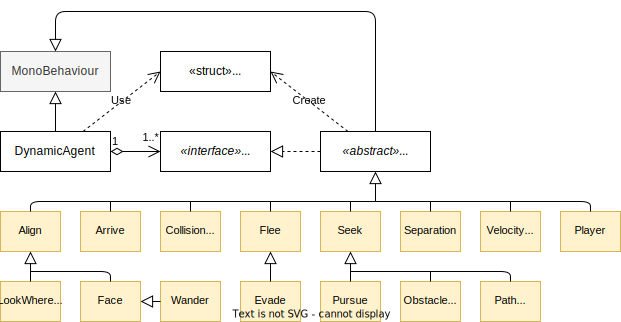

# Intelligent Movement

## Summary

This prototype contains 4x [kinematic movement scenes] and 16x [dynamic
movement scenes], plus a base scene that can be configured from scratch by
students. In kinematic movement scenes, students can change the agents’ steering
behavior (_seek_, _seek with arrive_, _flee_, _wander_), their target (to seek
or flee from), and maximum linear/angular speeds. In dynamic movement scenes,
students can compose the agents’ steering behavior from fundamental movements
(e.g., _seek_, _flee_, _collision avoidance_, _separation_, _wander_)—which can
be themselves configured—and weight them to create complex movement. Students
can also define the maximum speed and acceleration (linear and angular).

All examples are in 2D, and possible exercises and project assignments can
consist of generalizing the provided code to 3D.

## Supporting code structure

While [kinematic movement code] is fairly monolithic, the [dynamic movement
code] is fully modular, making it very simple to add new fundamental behaviors.
There is also some [common code] for both types of movement, and dynamic
movement is further supported by [code specific for defining paths].

The following UML class diagram summarizes the [dynamic movement code]:

## Other materials

- [Using the prototype (video)](https://youtu.be/IdosYkUjtXE)

[kinematic movement scenes]:Assets/Scenes/Kinematic
[dynamic movement scenes]:Assets/Scenes/Dynamic
[kinematic movement code]:Assets/Scripts/Kinematic
[dynamic movement code]:Assets/Scripts/Dynamic
[common code]:Assets/Scripts/Core
[code specific for defining paths]:Assets/Scripts/Paths