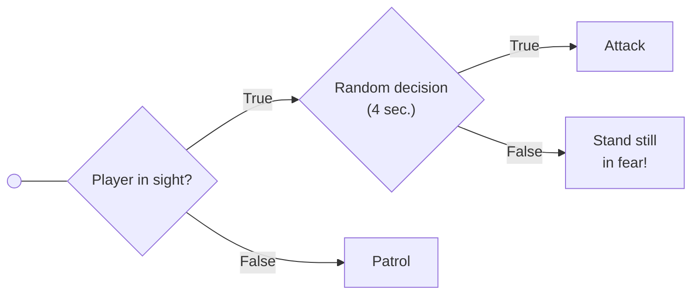

# Simple Decision Trees

## Summary

This prototype is initially provided to students as a 3D template containing a
player-controlled character and an agent which does nothing. The goal is for
students to implement the agent’s behavior specified by the following decision
tree:

This behavior consists of moving between waypoints, unless the player character
gets too close, in which case it can either go after the player (using kinematic
seek) or get confused and stop to think for a while; the selected behavior
should hold for a few seconds.

This behavior should be implemented with decision trees module of the
[libgameai] library. After students implement the required behavior, the
complete prototype is then provided, so that students can compare it to their
solution.

## Supporting code structure

This prototype uses the `DecisionTrees` module of the [libgameai] library (MIT License).

## Other materials

- [Using the prototype (video)](https://youtu.be/N_m4SA9YDb8)

[libgameai]:https://github.com/nunofachada/libgameai