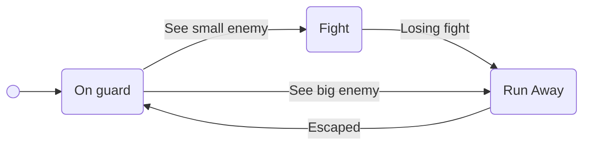

# Simple FSMs

## Summary

This prototype is initially provided to students as a 3D template with a
player-controlled character and an agent which does nothing (to be implemented
by students), but also a third, simple waypoint-traversing agent—the big agent.
The goal is for students to implement the agent’s behavior specified by the
following finite state machine (FSM):

In summary, the agent should seek the player when near, but run away when the
big agent approaches. The agent should also run away from the player while it
has memory of its encounter with the big agent and/or when chasing the player
for long enough (e.g. mimicking a losing fight). After a timeout, the agent
will be able to pursue the player once again.

This behavior should be implemented with `FSMs` module of the [libgameai]
library. The complete prototype is provided after students implement the
required behavior, so they can compare it to their own solutions.

## Supporting code structure

This prototype uses the `FSMs` module of the [libgameai] library (MIT License).

## Other materials

- [Using the prototype (video)](https://youtu.be/eyRhgCQ4HWw)

[libgameai]:https://github.com/nunofachada/libgameai